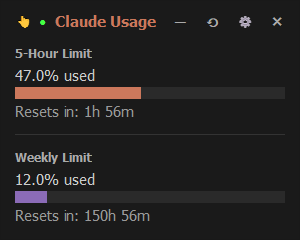

# ClaudeUsage

Lightweight Claude Usage Tracker
Open-source python script with .exe compiled for ease of use (feel free to recompile)
Just overlays this little widget on your screen, that's it.

Change the opacity, drag it off-screen, log in to your account once and you're done. 
Just a neat little script, co-authored by Claude Sonnet 4.5

# Running the script
Go to /dist dir
Click the .exe  (feel free to recompile for security)
It will take a while, and open a browser (cloudflare bypass - +- 20 seconds)
Sign in to claude like usual (check you're on the official website)
--> it will take your token and save it in localstorage
This will allow the script to check your usage with just one initial sign in forever.

Thanks for using!
Feel free to star if you think it's useful
